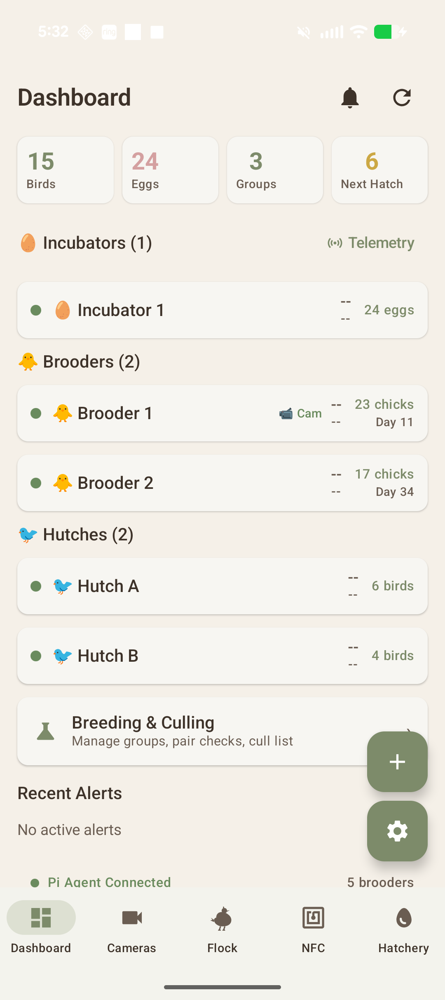
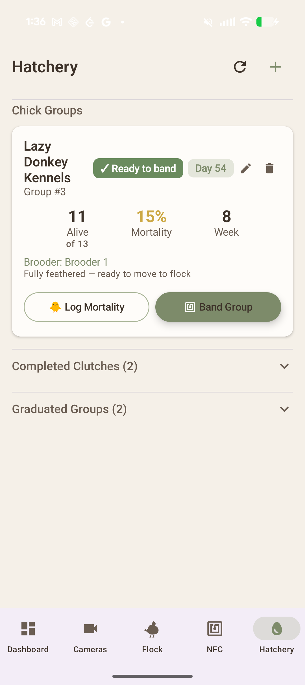
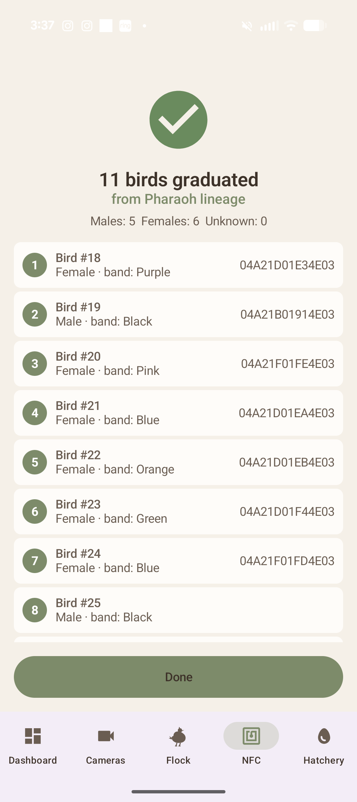
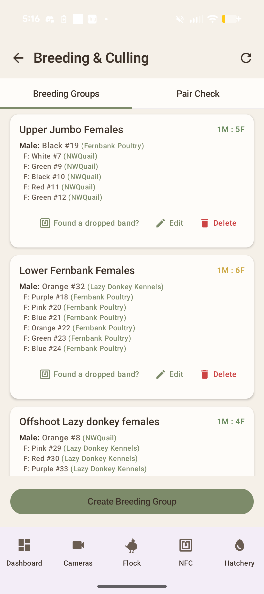
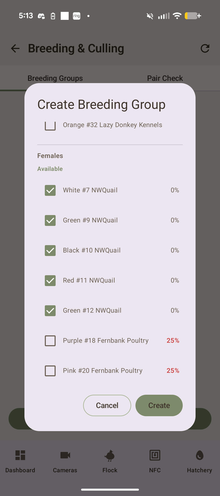
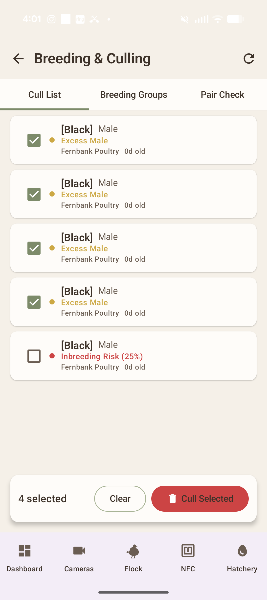

# QuailSync V2 🐦


**IoT-powered quail lifecycle management — from egg to adult.**

A full-stack IoT platform for managing a coturnix quail breeding operation. Real-time temperature monitoring, live camera feeds with QR detection, NFC bird tagging, hatchery tracking with fertility metrics, breeding intelligence with inbreeding analysis, and a native Android app — all built from scratch.
<p align="center">

</p>

<p align="center">
  
</p>
<p align="center">
  
</p>

---

## The Story

QuailSync started as a "how hard can it be" weekend project to monitor brooder temperatures with a Raspberry Pi. It turned into something much bigger.

<p align="center">
  
</p>

During our first real hatch — 45 coturnix eggs across two incubators — I woke up at 2am to a critical alert on my phone. QuailSync had detected Brooder 2 dropping below 60°F while the chicks were only 3 days old. I went out to check and found a corroded connection on the heating panel. The wire insulation had melted and was starting to discolor the plastic housing. If it had gone unnoticed for another few hours, those chicks would have died from cold stress. If it had gone a few days, it could have been a fire.

<p align="center">
  
</p>

That was the moment QuailSync stopped being a hobby project and became something I actually depend on. Every feature since then — the age-based temperature scheduling, the Android alerts, the camera feeds — came from a real need on the farm.

---

## Architecture

```
  ┌──────────────┐         ┌──────────────┐
  │  ESP32-C3    │         │  Pi Camera   │
  │  DHT22       │         │  ArduCam     │
  │  sensors     │         │  IMX477 HQ   │
  └──────┬───────┘         └──────┬───────┘
         │ WebSocket              │ MJPEG :8080
         ▼                        ▼
  ┌─────────────────────────────────────────┐
  │         Raspberry Pi 5                  │
  │                                         │
  │   pi_agent.py        camera_stream.py   │
  │   (telemetry)        (stream + QR scan) │
  └──────────┬──────────────────────────────┘
             │ WebSocket :3000/ws
             ▼
  ┌─────────────────────────────────────────┐
  │        Rust/Axum Server (Docker)        │
  │                                         │
  │  REST API ◄──► SQLite ◄──► Alert Engine │
  │  WebSocket Hub    │     Temp Scheduling  │
  │  rust-embed SPA   │     Breeding Calc    │
  └────────┬──────────┼────────┬────────────┘
           │          │        │
     WebSocket    Dashboard   REST + MJPEG
     /ws/live     index.html
           │                   │
           ▼                   ▼
  ┌────────────────┐  ┌────────────────────┐
  │ Web Dashboard  │  │  Android App       │
  │ Vanilla JS SPA │  │  Kotlin / Compose  │
  │ Real-time WS   │  │  NFC tagging       │
  │ Sparkline      │  │  Live temps        │
  │ charts         │  │  QR scanner        │
  └────────────────┘  │  Background alerts │
                      └────────────────────┘
```

---

## Features

### Real-Time Telemetry Dashboard

Live temperature and humidity from each brooder, updated every 5 seconds over WebSocket. Sparkline charts show trends. Status dots go green/yellow/red based on age-appropriate thresholds — week 1 chicks need 97°F, week 6 needs 72°F, and the system knows the difference.

<p align="center">
  
</p>

### Live Camera with QR Overlay

MJPEG streaming from Arducam IMX477 via the Pi. Multi-client support — dashboard, phone, and browser can all watch simultaneously. QR codes on each brooder box are automatically detected with pyzbar; green bounding boxes are drawn with OpenCV when a code is in frame.

<p align="center">
  
</p>

### NFC Bird Tagging

Every bird gets an NTAG215 NFC tag on its leg band. Tap the phone to a bird, get its full profile — weight history, lineage, breeding group, notes. Batch graduation workflow lets you tag an entire chick group in one session.

<table>
  <tr>
    <td></td>
    <td></td>
    <td></td>
  </tr>
  <tr>
    <td align="center"><em>Tap to pull up bird</em></td>
    <td align="center"><em>NFC tag management</em></td>
    <td align="center"><em>Batch graduation</em></td>
  </tr>
</table>

📖 Deep dive: [How NFC scanning, writing, and conflict resolution work](docs/NFC_ALGORITHM.md).

### Dropped-Tag Reconciliation

A leg band falls off and you find it on the hutch floor — but which bird does it belong to? Scan the dropped tag, describe the unbanded birds you can see, and the app deduces whose band it is: it *eliminates* candidates on hard attributes (sex, lineage), then *ranks* the survivors by band-color similarity. Read-only diagnosis — nothing is re-banded; you just re-attach the existing tag. Scoped to breeding groups, where the single male resolves instantly and the females split on lineage.

📖 Deep dive: [How dropped-tag deduction and Jaccard ranking work](docs/dropped_tag_deduction.md).

### Hatchery Tracking

17-day incubation timeline with visual progress rings. Candling records, hatch outcome logging — eggs hatched, stillborn, quit, infertile, damaged. Fertility rate and hatch rate displayed prominently with color coding. Android push notifications at key milestones (day 7 candle, day 14 lockdown, hatch day).

<table>
  <tr>
    <td></td>
    <td></td>
  </tr>
  <tr>
    <td align="center"><em>Incubation progress</em></td>
    <td align="center"><em>Hatch outcome tracking</em></td>
  </tr>
</table>

### Nursery with Graduation

Chick groups track mortality daily. When birds are old enough (28 days), graduate them to the main flock with per-bird sex selection, NFC tag writing, and weight logging — all in one flow on the Android app.

<table>
  <tr>
    <td></td>
    <td></td>
  </tr>
  <tr>
    <td align="center"><em>Chick group tracking</em></td>
    <td align="center"><em>Graduation to flock</em></td>
  </tr>
</table>

### Breeding Intelligence

Inbreeding coefficient calculated for every possible male-female pairing. Flags anything above 6.25% as risky. Breeding groups enforce 3-to-5 females per male. Safe pairing suggestions scored by genetic distance across lineages.

<table>
  <tr>
    <td valign="top" style="vertical-align: top; padding: 10px;"></td>
    <td valign="top" style="vertical-align: top; padding: 10px;"></td>
  </tr>
  <tr>
    <td align="center"><em>Pair check with coefficient</em></td>
    <td align="center"><em>Breeding group management</em></td>
  </tr>
</table>

<p align="center">
  
</p>

### Processing Pipeline

Cull recommendations based on excess male ratio, underweight birds, and inbreeding risk. Batch cull operations update multiple birds in one call. Kanban tracking from recommended through scheduled to completed.

### Temperature Scheduling by Chick Age

The alert engine automatically adjusts thresholds based on the youngest chick group in each brooder. Week 1: 97°F target. Steps down 5°F per week until week 6 when they're at room temperature. No manual threshold management needed.

---

## Android App

The native Kotlin/Jetpack Compose app is the primary field interface — NFC banding, batch graduation, breeding management, and cull selection, all backed by the same REST API as the web dashboard.

<table>
  <tr>
    <td width="50%"><br><em>Dashboard overview</em></td>
    <td width="50%"><br><em>Chick group management</em></td>
  </tr>
  <tr>
    <td width="50%"><br><em>NFC batch graduation</em></td>
    <td width="50%"><br><em>Breeding groups with M:F ratios</em></td>
  </tr>
  <tr>
    <td width="50%"><br><em>Inbreeding risk warnings</em></td>
    <td width="50%"><br><em>Batch cull selection</em></td>
  </tr>
</table>

---

## Tech Stack

| Layer | Technology |
|---|---|
| Server | Rust, Axum 0.8, SQLite (rusqlite), Tokio, rust-embed |
| Web Dashboard | Vanilla JS single-file SPA, WebSocket, hash-based routing, no build step |
| Android App | Kotlin, Jetpack Compose, ML Kit barcode scanning, CameraX, NFC/NDEF |
| Pi Sensor Agent | Python 3, Linux kernel IIO drivers (DHT22), websockets, psutil |
| Pi Camera | Python 3, picamera2, pyzbar, OpenCV, ThreadingHTTPServer |
| ESP32 Nodes | ESP32-C3 Super Mini, DHT22, Arduino framework, WebSocket client |
| Cloud | Azure Kubernetes Service (AKS), Azure Container Registry, Caddy (auto HTTPS via Let's Encrypt) |
| CI/CD | GitHub Actions — fmt, clippy, test, Docker build, AKS rolling deploy |
| Observability | Prometheus (metrics scraping), Grafana (dashboards), `metrics` crate |
| Remote Access | Tailscale (mesh VPN connecting Pi edge device to cloud server) |
| Deployment | AKS (server), Docker Compose (local/Pi), systemd (cameras), Arduino IDE (ESP32) |

---

## Testing

QuailSync ships **~377 automated tests** across Rust, Python, and Kotlin. Every suite is isolated — Rust integration tests spin up a fresh Axum server on a random port with an in-memory SQLite DB, the trail-cam pipeline mocks all I/O, and the e2e suites run against a freshly seeded dev DB.

```bash
# Rust — server + shared crates (unit + integration + boundary)
cargo fmt --check && cargo clippy && cargo test

# Trail-cam pipeline (Python / pytest)
cd trailcam && pytest -m "not integration"   # fast; add -m integration for the real-model test

# Web dashboard e2e (Playwright) and Android e2e (Jetpack Compose, on device/emulator)
pytest tests/test_dashboard_e2e.py
cd android && ./gradlew connectedDebugAndroidTest
```

| Suite | Type | Tests | What it covers |
|---|---|---:|---|
| `quailsync-common` | Rust unit | 16 | Serde round-trips + domain logic for shared types — `Sex`/`BirdStatus`/`ClutchStatus` enums, telemetry payload variants, `InbreedingCoefficient` thresholds (safe < 6.25%, unsafe ≥). |
| `quailsync-server` | Rust unit | 44 | In-crate logic: temperature alert engine, dropped-tag reconciliation deduction, relatedness/inbreeding scoring, chick-group graduation, DB helpers. |
| `tests/api_tests.rs` | Rust integration | 46 | Fresh Axum server + in-memory SQLite per test — lineages, birds, breeding groups + pairing suggestions, tag reconciliation over HTTP, and schema migrations (legacy bloodline→lineage, breeding-group `male_id`→junction). |
| `tests/boundary_tests.rs` | Rust boundary / stress | 68 | "Try to break it": input validation (SQLi / XSS / null bytes / 10k-char strings), DB boundaries, WebSocket abuse (1MB messages, 100 concurrent clients), alert edge values (NaN / Infinity), path traversal, 50-task concurrent-write stress, breeding-group lifecycle. |
| `tests/photo_upload_tests.rs` | Rust integration | 15 | Bird-photo upload + serving — multipart validation (10MB → 413, JPEG magic bytes → 415), timestamped history, copy-then-commit DB, ntfy alert on oversized, GET serving + history listing + per-file 404 scoping. |
| `pi-agent/tests/test_pi_agent.py` | Python (pytest) | 66 | DHT22 sensor edge cases (None / checksum-fail / extremes), WebSocket resilience + reconnect backoff, multi-client MJPEG stream under load, QR-code parsing abuse. |
| `trailcam/tests/test_config.py` | Python (pytest) | 5 | Env-driven settings, defaults, `pathlib` directory layout, `ensure_dirs()`. |
| `trailcam/tests/test_photo_state.py` | Python (pytest) | 6 | JSON dedup ledger — missing/corrupt → empty, id normalization, atomic save → reload. |
| `trailcam/tests/test_poller.py` | Python (pytest) | 5 | SpyPoint poller (`spypoint.Client` + `requests` mocked): new-photo download + sidecars, skip-seen, retry/backoff, give-up-leaves-unseen. |
| `trailcam/tests/test_detector.py` | Python (pytest) | 6 | YOLO detection (Ultralytics mocked): result shape, confidence passthrough, sidecar fallback, `process_staging()` file moves. One `@pytest.mark.integration` test runs the real stock `yolov8n.pt`. |
| `trailcam/tests/test_bridge.py` | Python (pytest) | 6 | Observation payload + JSONL output, average/min confidence, `post_batch()` counts, write-failure handling. |
| `trailcam/tests/test_integration.py` | Python (pytest) | 1 | Full chain (PIL images + mocked model): staging → processed move, detection JSON written, observations logged. |
| `trailcam/tests/test_security.py` | Python (pytest) | 25 | Hardening: path traversal / `sanitize_filename`, download size caps, HTTPS-only, credential non-leakage (logs + files), `0o600` state file, model integrity (world-writable warning + optional SHA-256). |
| `trailcam/tests/test_advanced_security.py` | Python (pytest) | 40 | Deeper attack vectors: TLS verification, SSRF + DNS rebinding (incl. the `169.254.169.254` metadata endpoint), malformed responses (payload bomb / 1000-level nesting), image validation (PNG / HTML / garbage), EXIF stripping, credential & `repr()` redaction, bridge input sanitization. |
| `tests/test_dashboard_e2e.py` | Python (Playwright) | 14 | Browser end-to-end of the web dashboard SPA against a freshly seeded dev DB — navigation, hatchery, NFC banding, breeding, and cull flows. |
| `android/…/DashboardE2ETest.kt` | Kotlin (Compose, instrumented) | 14 | On-device / emulator UI end-to-end of the Android app. |

> **Isolation notes.** The trail-cam pytest suites are **hermetic** — no test hits the real SpyPoint API, real model weights, or the network (the client, HTTP session, and DNS resolver are mocked; filesystem tests use `tmp_path`). The lone `@pytest.mark.integration` detector test (and the standalone, non-pytest `trailcam/test_pipeline.py` smoke test — run with `python trailcam/test_pipeline.py`) exercise the *real* `yolov8n.pt` end-to-end and are skipped by default.

### CI Pipeline

GitHub Actions runs `cargo fmt --check`, `cargo clippy`, and `cargo test` on every push to `main`. All three must pass before merging.

---

## Hardware

### Raspberry Pi 5 (8GB)

The brain of the operation. Runs the Rust/Axum server in Docker, the camera stream as a systemd service, and coordinates all sensor data. Ubuntu Server, headless, accessed via SSH.

### ESP32-C3 Super Mini — Wireless Sensor Nodes

One per brooder. Each board has a DHT22 wired to GPIO4, connects over WiFi, and sends temperature/humidity readings every 5 seconds via WebSocket. Auto-creates its brooder entry on the server when it first connects. Powered by USB-C wall adapters.

### Arducam IMX477 HQ Camera

12.3MP Sony sensor with a 6mm CS-mount manual focus lens. Streams MJPEG at 640x480 to support dual simultaneous streams without exhausting DMA memory. Runs outside Docker via systemd because Pi camera drivers need direct hardware access.

### DHT22 Temperature/Humidity Sensors

One per brooder, soldered to the ESP32-C3 nodes. Reads every 5 seconds. The alert engine cross-references these readings against age-based temperature targets for whatever chick group is in that brooder.

### XH-W3002 Temperature Controller

Hardware backup thermostat on the brooders, independent of QuailSync. P0/P1 set points control the heating panel directly. This is the failsafe — if the Pi goes down, the brooders still have heat control.

### NFC Tags (NTAG215)

Attached to leg bands on each bird. Read/written via the Android app using the phone's built-in NFC. Stores the bird's database ID so a tap pulls up its full profile instantly.

### Incubators

Nurture Right 360 (primary) and Magicfly (secondary) for staggered hatches across lineages. Coturnix quail have a 17-day incubation cycle.

---

## 3D Printed Parts

All parts designed in OpenSCAD and trimesh, printed on an Artillery Sidewinder X in PLA.

**Print settings:** 0.2mm layer height, 20% infill, no supports needed.

### Camera Stand

Two-piece design (`CAD/hq_camera_stand.stl` + snap-on `CAD/hq_backplate.stl`). Weighted base with coin pockets for stability, tapered column with cable channel, 3-sided cradle holding the Arducam at a 3° downward tilt. Snap-on backplate with ribbon cable exit slots and a catch lip.

<!-- TODO: Photo of printed camera stand -->

### ESP32 Sensor Enclosures

Vented housing with an L-hook for mounting on 15mm brooder walls. Snap-fit lid, USB cable trough along the hook, and internal standoffs for the DHT22. Three labeled versions (Sensor 1, 2, 3). Iterated from wired sensor pods to wireless ESP32 enclosures as the project evolved. Printed as two parts: `CAD/esp32_sensor_base.stl` (housing) and `CAD/esp32_sensor_lid.stl` (snap-fit lid).

<table>
  <tr>
    <td></td>
    <td></td>
  </tr>
  <tr>
    <td align="center"><em>v1 — Wired sensor pods</em></td>
    <td align="center"><em>v2 — Wireless ESP32 with C bracket</em></td>
  </tr>
</table>

### Pi 5 Case Lid

Custom lid for the CanaKit Turbine case with camera ribbon cable slots rotated 90° for cleaner routing (`CAD/canakit_lid.stl`).

STL files are in the `/CAD` directory.

---

## Project Structure

```
QuailSyncV2/
├── crates/
│   ├── quailsync-server/        # Axum REST API + WebSocket + alert engine
│   │   ├── src/
│   │   │   ├── lib.rs           # Router setup, static file handler
│   │   │   ├── main.rs          # Startup, TLS, dual HTTP/HTTPS
│   │   │   ├── routes/          # Modular route handlers
│   │   │   ├── db/              # Schema, migrations, helpers
│   │   │   ├── ws.rs            # WebSocket telemetry + broadcast
│   │   │   ├── state.rs         # AppState, sensor tracking
│   │   │   └── alerts.rs        # Temperature alert engine
│   │   └── tests/               # Integration + boundary tests
│   ├── quailsync-common/        # Shared types, enums, constants
│   ├── quailsync-agent/         # Mock agent for dev (fake telemetry)
│   └── quailsync-cli/           # CLI tool — flock mgmt, QR generation
├── dashboard/
│   └── index.html               # Single-file SPA (HTML + CSS + JS)
├── android/                     # Kotlin/Jetpack Compose native app
├── pi-agent/
│   ├── pi_agent.py              # DHT22 sensor agent (IIO + WebSocket)
│   ├── camera_stream.py         # MJPEG + QR scanner + multi-client
│   └── requirements-pi.txt
├── hardware/
│   └── esp32/                   # ESP32-C3 sensor firmware (Arduino)
├── CAD/
│   ├── camera_stand_v4.scad     # Parametric OpenSCAD source
│   └── *.stl                    # Print-ready meshes
├── deploy/
│   └── quailsync-camera.service # systemd unit for camera stream
├── docker-compose.yml           # Server deployment
└── brooder-*-qr.svg             # Pre-generated QR codes per brooder
```

---

## Setup & Deployment

### Server (Docker on Pi)

```bash
docker compose up -d --build
```

> **Migration note (2026-05):** Bloodline was renamed to **lineage**, and chick groups + birds now support **multiple lineages per record** (many-to-many). Existing data is migrated automatically on server startup: the legacy `bloodlines` table is renamed to `lineages`, the legacy `bloodline_id` columns on `chick_groups` and `birds` are backfilled into the new `chick_group_lineages` / `bird_lineages` junction tables, and the old columns are dropped. The migration is idempotent and runs every boot.
>
> **Before deploying on the Pi**, take a backup with the existing nightly script (or run it manually so you have an off-host copy in `/mnt/pc-snapshots/nightly/`):
>
> ```bash
> bash scripts/nightly-backup.sh
> sudo docker compose pull server   # pull the new image
> sudo docker compose up -d server  # migration runs on boot
> tail -n 50 /var/log/quailsync.log # confirm "init" + no errors
> ```
>
> Clients (Android app, web dashboard, `quailsync-cli`) speak the new API — `/api/lineages`, `lineage_ids: [...]` arrays for chick group + bird creation. Old build of the Android app talking to the new server will fail on chick group create until updated.


The server runs on port 3000 (HTTP) and 3443 (HTTPS with auto-generated self-signed certs). The SQLite database is created on first run.

### Camera (systemd on Pi)

Cameras run as systemd services directly on the Pi — not in Docker, because the Pi camera driver needs direct hardware access.

```bash
sudo cp deploy/quailsync-camera.service /etc/systemd/system/
sudo systemctl daemon-reload
sudo systemctl enable --now quailsync-camera
```

### ESP32 Sensor Nodes

Flash via Arduino IDE. Set the WebSocket server URL and brooder ID in the firmware. Each ESP32-C3 Super Mini reads its DHT22 and sends telemetry every 5 seconds.

### Android App

Build from the `android/` directory in Android Studio. Requires a device with NFC for tag scanning. The server URL is configurable in Settings (defaults to `192.168.0.114:3000`).

### Deployment Workflow

My actual workflow: edit locally with Claude Code, `git push`, then on the Pi:

```bash
cd ~/quailsync && git reset --hard origin/main && docker compose up -d --build
```

Camera service picks up changes with `sudo systemctl restart quailsync-camera`.

---

## Observability

Prometheus and Grafana run alongside the QuailSync server via Docker Compose, providing real-time metrics and historical dashboards.

The Rust server exposes a `GET /metrics` endpoint in Prometheus text format. Prometheus scrapes it every 15 seconds and collects:

- **`quailsync_temperature_fahrenheit`** — current temperature per brooder (gauge, labeled by brooder ID)
- **`quailsync_humidity_percent`** — current humidity per brooder (gauge)
- **`quailsync_alerts_total`** — alert count by severity: info, warning, critical (counter)
- **`quailsync_websocket_connections`** — active WebSocket connections by type: agent, live (gauge)
- **`quailsync_http_requests_total`** — HTTP request count by endpoint path (counter)

Grafana runs on port 3001 (default login: admin / quailsync) and connects to Prometheus as a data source. Use it to build dashboards for brooder temperature trends over time, alert frequency, and system health.

```bash
# Everything starts together
docker compose up -d

# Prometheus UI: http://<pi-ip>:9090
# Grafana UI:    http://<pi-ip>:3001
```

---

## Pi Backups & Maintenance

Three shell scripts in `scripts/` keep the Pi's data safe and the disk healthy. They're meant to run from cron under the `gwetherholt` user; `scripts/install-cron.sh` wires everything up idempotently.

| Script | Cron | What it does |
| --- | --- | --- |
| `nightly-backup.sh` | `0 2 * * *` | Hot SQLite `.backup` of `quailsync.db` → gzipped to `/mnt/pc-snapshots/nightly/quailsync-YYYY-MM-DD.db.gz`. Verifies size + `gunzip -t`. Prunes files older than 7 days. |
| `morning-backup-verify.sh` | `0 8 * * *` | Deadman switch — alerts if today's backup file is missing or older than 12 hours. |
| `weekly-cleanup.sh` | `0 3 * * 0` | Truncates Docker JSON logs >100 MB, deletes app-generated backups in `~/QuailSyncV2/backups/` older than 7 days, runs `docker image prune`, `journalctl --vacuum-time=14d`, and `apt clean`. |

**Notifications** go to the QuailSync server's `/api/alerts` endpoint and surface in the Android app via the Dashboard bell icon (no third-party service required). Each script POSTs to `http://localhost:3000/api/alerts` on failure and to `/api/alerts/resolve` on a successful run, so a recovered run auto-clears any prior failure alert. Curl uses `--max-time 10`; if the server is unreachable, the script logs and continues — it does not re-fail on notify error.

| Script | alert_key | Severity | Notifies on |
| --- | --- | --- | --- |
| `nightly-backup.sh` | `backup_failed` | critical | failure |
| `morning-backup-verify.sh` | `deadman_no_recent_backup` | critical | failure |
| `weekly-cleanup.sh` | `cleanup_failed` | warning | failure |

Repeat failures with the same `alert_key` collapse onto a single row (with an `occurrences` counter in `metadata_json`) so the bell badge doesn't accumulate dupes night after night.

**Logs** (grep-friendly: `ISO-8601-UTC <STATUS> <reason>` per line):

- `/var/log/quailsync-backup.log` — nightly + morning verify
- `/var/log/quailsync-cleanup.log` — weekly cleanup

```bash
# Install cron + sudoers fragment + log files (run on the Pi as gwetherholt):
bash scripts/install-cron.sh

# Manually trigger / test:
bash scripts/nightly-backup.sh --dry-run   # walks every step, writes nothing
bash scripts/nightly-backup.sh             # real run
bash scripts/morning-backup-verify.sh
bash scripts/weekly-cleanup.sh

# Quick "did last night go ok?" check:
tail -n 1 /var/log/quailsync-backup.log
grep -E ' FAIL ' /var/log/quailsync-backup.log | tail

# Inspect alerts directly:
curl -s http://localhost:3000/api/alerts/active | jq
```

**Pointing scripts at a different server** — edit the `SERVER_URL=` constant at the top of each script. Default is `http://localhost:3000` since the scripts run on the Pi, which is the server itself.

**End-to-end smoke test** (run on the Pi):

1. Trigger a fake failure — temporarily edit `BACKUP_DIR=/nonexistent` in `scripts/nightly-backup.sh` and run `bash scripts/nightly-backup.sh`. Expect non-zero exit and a `FAIL` line in the log.
2. Open the Android app → Dashboard → bell icon shows a red **1** badge → tap → AlertsScreen shows a "Backup failed" card.
3. Revert `BACKUP_DIR` and re-run normally. The script POSTs `/api/alerts/resolve` on success.
4. Within 30 seconds the bell badge clears (next foreground poll picks up the auto-resolve).

**Why `sqlite3 .backup` instead of `cp`** — copying a live SQLite file is unsafe; a write in flight produces a corrupt copy. The `.backup` command takes a consistent snapshot while the server keeps writing.

**Retention summary** — 7 days of nightly snapshots on SMB, 7 days of app-generated backups locally (pruned weekly), 14 days of systemd journal, dangling Docker images cleared weekly.

---

## Remote Access

[Tailscale](https://tailscale.com) provides secure remote access to the entire QuailSync stack without port forwarding or firewall changes. Install Tailscale on the Pi and on any client device (phone, laptop), and everything is accessible over a private mesh VPN.

With Tailscale running, the full stack works from anywhere — cellular, coffee shop WiFi, or another network entirely:

- **Dashboard**: `http://<tailscale-ip>:3000`
- **Grafana**: `http://<tailscale-ip>:3001`
- **Camera stream**: `http://<tailscale-ip>:8080/stream`
- **Android app**: Set the server URL in Settings to the Tailscale IP

The Android app automatically rewrites camera stream URLs to use the configured server host, so camera feeds work seamlessly over Tailscale even though the Pi announces its LAN IP internally.

---

## Cloud Deployment (Azure)

QuailSync runs as a cloud-edge hybrid: the Rust server runs on Azure Kubernetes Service (AKS) while the Raspberry Pi handles sensor hardware and camera streams locally.

### Architecture

- **Server**: AKS cluster (Standard_B2s_v2 node) running the Rust/Axum server with a Caddy sidecar for automatic HTTPS
- **Registry**: Azure Container Registry (`quailsyncregistry.azurecr.io`)
- **Storage**: Azure Managed Disk (1Gi, managed-csi) for SQLite persistence
- **DNS**: `quailsync.tail01d133.ts.net` (Tailscale Funnel)
- **TLS**: Automatic Let's Encrypt via Caddy — zero-config HTTPS
- **Remote Access**: Tailscale VPN mesh connects Pi camera streams to the cloud dashboard

### CI/CD Pipeline

GitHub Actions pipeline on every push to `main`:

1. `cargo fmt` + `clippy` + `cargo test` (quality gate)
2. Docker build and push to ACR (tagged with commit SHA + `latest`)
3. `kubectl apply` manifests + rolling deployment to AKS
4. `kubectl rollout status` waits for healthy deployment

```bash
# Manual deploy (if needed)
kubectl apply -f deploy/k8s/
kubectl set image deployment/quailsync-server \
  quailsync-server=quailsyncregistry.azurecr.io/quailsync-server:<sha>
```

Kubernetes manifests are in `deploy/k8s/`.

### Edge Device (Raspberry Pi 5)

The Pi runs locally and connects to the cloud server:

- **Sensor agent** streams telemetry via WebSocket to `wss://quailsync.tail01d133.ts.net/ws`
- **Camera** streams MJPEG over Tailscale — the `--advertise-ip` flag announces the Tailscale IP so remote clients can reach the stream
- **ESP32-C3** wireless nodes send temperature/humidity readings directly to the Azure endpoint

---

## API Endpoints

### WebSocket

| Path | Description |
|---|---|
| `/ws` | Agent telemetry ingestion (Brooder, System, Detection, CameraAnnounce, QrDetected) |
| `/ws/live` | Live broadcast to dashboard/app clients |

### REST

| Method | Path | Description |
|---|---|---|
| GET | `/api/brooders` | List brooders with latest readings |
| POST | `/api/brooders` | Create brooder |
| PUT | `/api/brooders/{id}` | Update brooder (name, camera_url, qr_code, lineage_id) |
| DELETE | `/api/brooders/{id}` | Delete brooder + all readings |
| GET | `/api/brooders/{id}/status` | Current reading + alert state |
| GET | `/api/brooders/{id}/readings` | Historical readings |
| GET | `/api/brooders/{id}/target-temp` | Age-based temperature schedule |
| GET | `/api/brooders/{id}/alerts` | Per-brooder alerts |
| GET | `/api/birds` | List all birds |
| POST | `/api/birds` | Create bird |
| PUT | `/api/birds/{id}` | Update bird |
| DELETE | `/api/birds/{id}` | Delete bird |
| POST | `/api/birds/{id}/weights` | Log weight |
| GET | `/api/birds/{id}/weights` | Weight history |
| GET | `/api/nfc/{tag_id}` | Look up bird by NFC tag |
| GET | `/api/lineages` | List lineages |
| POST | `/api/lineages` | Create lineage |
| GET | `/api/breeding-groups` | List breeding groups |
| POST | `/api/breeding-groups` | Create group (validates male:female ratio) |
| GET | `/api/breeding/suggest` | Inbreeding-scored pair suggestions |
| GET | `/api/inbreeding-check` | Check single male-female pair |
| GET | `/api/clutches` | List clutches |
| POST | `/api/clutches` | Create clutch (auto 17-day hatch date) |
| PUT | `/api/clutches/{id}` | Update (candling, hatch outcome) |
| GET | `/api/chick-groups` | List chick groups |
| POST | `/api/chick-groups` | Create chick group |
| POST | `/api/chick-groups/{id}/mortality` | Log chick losses |
| POST | `/api/chick-groups/{id}/graduate` | Promote to main flock |
| GET | `/api/flock/summary` | Flock statistics |
| GET | `/api/flock/cull-recommendations` | Birds flagged for processing |
| POST | `/api/cull-batch` | Batch cull operation |
| GET | `/api/processing` | Processing records |
| POST | `/api/processing` | Schedule processing |
| GET | `/api/cameras` | List cameras |
| POST | `/api/cameras` | Add camera |
| POST | `/api/backup` | Create database backup |
| GET | `/api/backups` | List backups |
| POST | `/api/restore` | Restore from backup |

---

## Roadmap

### Done
- [x] Real-time temperature & humidity monitoring
- [x] Live MJPEG camera streaming (multi-client)
- [x] QR code detection with OpenCV overlay
- [x] NFC bird tagging with batch graduation
- [x] WebSocket telemetry broadcast
- [x] Age-based temperature alert engine
- [x] Hatchery tracking with fertility/hatch rate metrics
- [x] Breeding intelligence with inbreeding coefficients
- [x] Nursery management with mortality logging
- [x] Processing pipeline with batch cull
- [x] ESP32-C3 wireless sensor nodes
- [x] Native Android app (Compose)
- [x] 3D printed camera hardware
- [x] Docker Compose deployment
- [x] systemd service for cameras
- [x] CI pipeline (fmt, clippy, test)
- [x] Brooder deletion with cascade cleanup
- [x] Configurable server URL (Android Settings)

### Planned
- [ ] YOLOv8 quail detection from camera feeds
- [ ] Automated headcount from video
- [ ] Male/female classification by plumage
- [ ] Behavior anomaly detection
- [ ] Weight estimation from camera (no scale needed)
- [ ] Historical data export (CSV/JSON)
- [ ] Multi-Pi support (separate sensor clusters)
- [ ] Second camera on Pi cam1 port

---

## License

Personal project by [Georgia Wetherholt](https://linkedin.com/in/gwetherholt).

---

*Built with Rust, Python, solder, and way too many quail eggs.*
