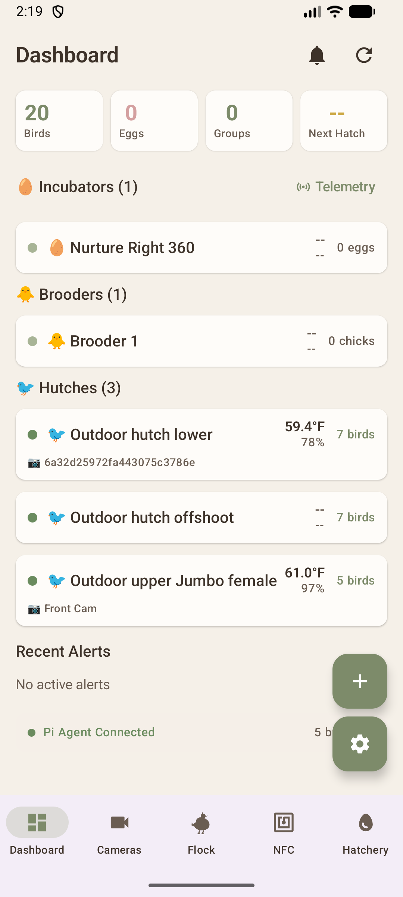
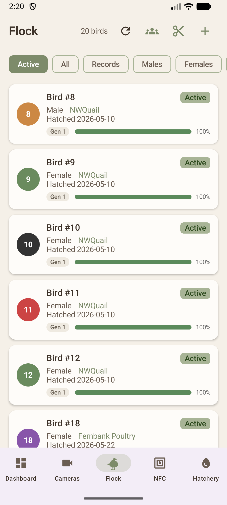
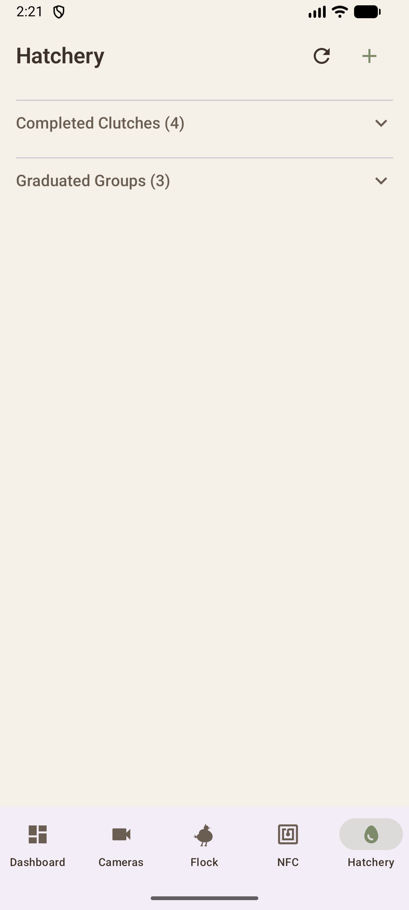
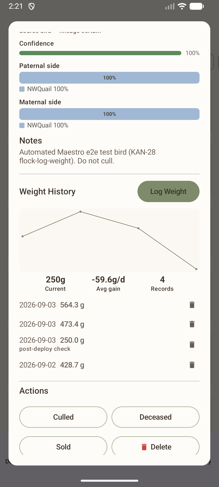

# QuailSync Android — Features

<!-- GENERATED FILE — do not edit by hand. Regenerate with: pwsh maestro/run.ps1 && python scripts/gen_features.py -->

A feature is listed here only if it has a Maestro flow. Status and screenshots come from a real run against a real device talking to the real backend — nothing on this page is written by hand.

- **Last run:** 2026-09-03T21:22:35Z
- **Maestro:** 2.6.1
- **Device:** emulator-5554

**4 passing · 0 failing · 0 not run**

| Feature | Status | Flow |
| --- | --- | --- |
| [Dashboard overview](#dashboard-overview) | ✅ **PASSING** | `dashboard-overview` |
| [Flock list](#flock-list) | ✅ **PASSING** | `flock-list` |
| [Hatchery list](#hatchery-list) | ✅ **PASSING** | `hatchery-list` |
| [Log a bird weight](#log-a-bird-weight) | ✅ **PASSING** | `flock-log-weight` |

---

## Dashboard overview

✅ **PASSING**

Opens the Dashboard tab and shows the quick-stats row (Birds, Eggs, Groups, Next Hatch) populated from the server.

- **Flow:** [`maestro/flows/dashboard-overview.yaml`](../maestro/flows/dashboard-overview.yaml)
- **App:** `com.quailsync.app`
- **Last run:** 2026-09-03T21:19:20Z
- **Duration:** 39s

---

## Flock list

✅ **PASSING**

Opens the Flock tab and shows the list of birds loaded from the server.

- **Flow:** [`maestro/flows/flock-list.yaml`](../maestro/flows/flock-list.yaml)
- **App:** `com.quailsync.app`
- **Last run:** 2026-09-03T21:19:59Z
- **Duration:** 43.1s

---

## Hatchery list

✅ **PASSING**

Opens the Hatchery tab and shows the clutch and chick-group sections loaded from the server.

- **Flow:** [`maestro/flows/hatchery-list.yaml`](../maestro/flows/hatchery-list.yaml)
- **App:** `com.quailsync.app`
- **Last run:** 2026-09-03T21:21:55Z
- **Duration:** 39.6s

---

## Log a bird weight

✅ **PASSING**

Opens a bird from the Flock list, logs a weight, and shows the new entry in that bird's weight history.

- **Flow:** [`maestro/flows/flock-log-weight.yaml`](../maestro/flows/flock-log-weight.yaml)
- **App:** `com.quailsync.app`
- **Last run:** 2026-09-03T21:20:42Z
- **Duration:** 73s

---
